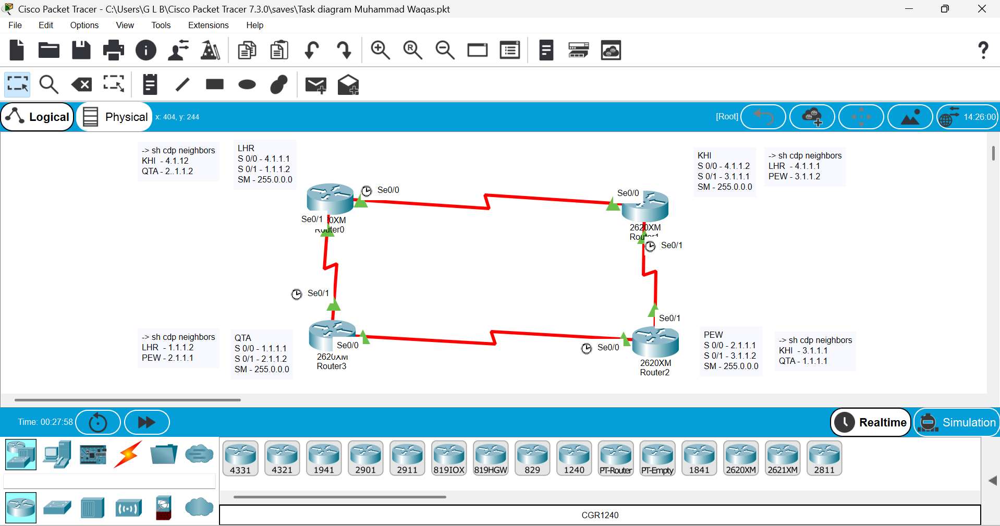

# Four-Router WAN Topology

## Overview

This Cisco Packet Tracer project demonstrates a four-router WAN topology using Cisco 2620XM routers connected through serial interfaces.

## Network Devices

- LHR Router
- KHI Router
- QTA Router
- PEW Router

## Technologies and Concepts

- Cisco IOS
- Serial WAN Connections
- IP Addressing
- Interface Configuration
- CDP (Cisco Discovery Protocol)
- Network Topology Design

## Verification

The following command was used to verify directly connected Cisco devices:

```bash
show cdp neighbors

## Topology


